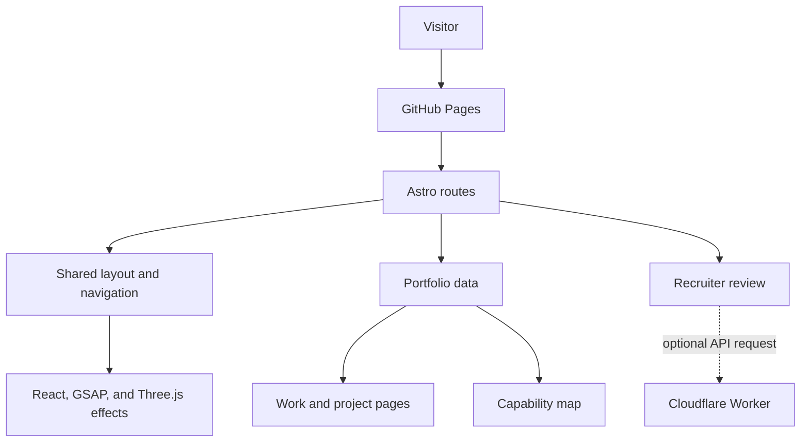
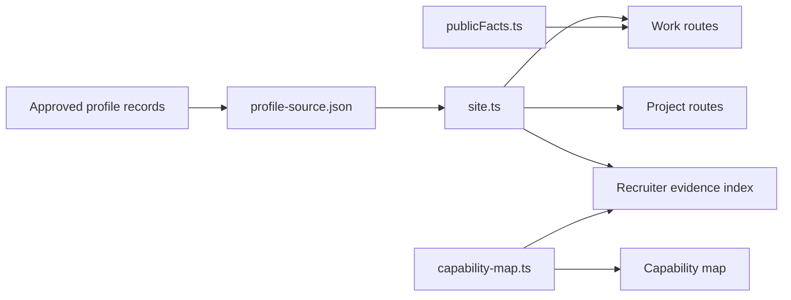

[](https://github.com/burtonmakes/burtonmakes.github.io/actions/workflows/deploy.yml)
[](https://github.com/burtonmakes/burtonmakes.github.io/actions/workflows/validate.yml)

# Burton Makes

Burton Makes is Alex Burton's public engineering portfolio. It brings professional work, technical projects, measurable outcomes, hobbies, and interactive demonstrations into one evidence-based site.

**Live site:** [burtonmakes.github.io](https://burtonmakes.github.io)

The repository is public for two reasons:

- to make the structure behind the portfolio as transparent as the work it presents;
- to give engineers, researchers, and makers a practical reference for documenting their own work.

This is a working portfolio rather than an empty starter theme. The architecture, page patterns, and data model can be adapted; a personal fork replaces Alex's writing, images, identity, and project facts with its owner's material.

## What the site demonstrates

- A portfolio organized around evidence instead of a long résumé page
- Separate but connected views for roles, projects, capabilities, and quantitative results
- Data-driven detail pages generated from structured records
- A recruiter review that connects a job description to public portfolio evidence
- A scroll-driven Three.js product story for the Cocometric infrastructure project
- Static deployment through Astro and GitHub Pages

## Architecture at a glance



Astro generates the public HTML. `BaseLayout.astro` supplies the shared shell, React components add site-wide motion and WebGL effects, and structured data supplies the work and project pages. The recruiter review can call the included Cloudflare Worker, while the rest of the portfolio remains a static site.

## Page map

| Route | Purpose | Primary source |
| --- | --- | --- |
| `/` | Introduces Alex's engineering story and directs visitors to the main areas. | `src/pages/index.astro` |
| `/work/` | Presents the career timeline, role scope, accomplishments, metrics, and skills. | `src/pages/work/index.astro` |
| `/work/[id]/` | Generates one detail page for each role. | `src/pages/work/[id].astro` + `workHistory` |
| `/work/map/` | Connects capabilities to the roles and projects that demonstrate them. | `src/pages/work/map/index.astro` + `capability-map.ts` |
| `/projects/` | Filters and summarizes the complete public project set. | `src/pages/projects/index.astro` |
| `/projects/[slug]/` | Generates a project case study with facts, decisions, failures, and lessons. | `src/pages/projects/[slug].astro` + `projects` |
| `/hobbies/` | Adds personal context through outdoor, maker, and repair activities. | `src/pages/hobbies/index.astro` |
| `/contact/` | Links to current contact and professional profiles. | `src/pages/contact/index.astro` |
| `/recruiter/start/` | Collects optional recruiter and role context in browser storage. | `src/pages/recruiter/start.astro` |
| `/recruiter/` | Reviews a role against documented public evidence. | `src/pages/recruiter/index.astro` |
| `/cocometric/` | Shows a scroll-driven, exploded 3D infrastructure story. | `src/pages/cocometric/index.astro` |

## Repository map

| Path | What it contains | Why it exists |
| --- | --- | --- |
| `src/pages/` | Astro route files | Keeps each public page discoverable from the URL structure. |
| `src/layouts/BaseLayout.astro` | Metadata, navigation, footer, and shared visual shell | Gives the main portfolio pages one consistent frame. |
| `src/components/BackgroundEffects.jsx` | Three.js particles, network animation, and pointer spotlight | Creates the technical background without coupling it to page content. |
| `src/components/GlobalEffects.jsx` | Reveal motion, navigation behavior, interaction tracking, and shared page effects | Centralizes behavior used across several routes. |
| `src/data/generated/profile-source.json` | Public work and project records | Provides the structured content used to generate detail pages. |
| `src/data/site.ts` | Site metadata and the main data contract | Exposes profile records in a stable shape to the routes. |
| `src/data/publicFacts.ts` | Curated quantitative proof points | Keeps important metrics reusable across portfolio views. |
| `src/data/capability-map.ts` | Capability taxonomy and evidence links | Connects broad skills to concrete roles and projects. |
| `src/styles/` | Global, recruiter, and Cocometric styles | Separates the shared visual system from feature-specific layouts. |
| `src/scripts/cocometric-viewer.js` | 3D model loading, camera stages, highlighting, and scroll behavior | Keeps the Cocometric experience independent from the main layout. |
| `public/` | Static images, icons, and browser helpers | Serves files that do not need Astro processing. |
| `workers/recruiter-match/` | Optional Cloudflare Worker | Adds retrieved, source-backed role analysis and portfolio chat. |
| `scripts/` | Validation, profile synchronization, and Worker deployment utilities | Makes content and interactive features reproducible. |
| `.github/workflows/` | Site validation and GitHub Pages deployment | Tests proposed changes and publishes `main`. |

More detail is available in [Site architecture](docs/SITE_ARCHITECTURE.md).

## How portfolio information moves through the site



The committed JSON file contains only information intended for public display. In Alex's workflow, `scripts/sync-profile-source.mjs` can refresh that snapshot from a separate source repository. A fork can keep the same split-source approach or replace it with a single public JSON file.

## Run locally

The GitHub workflows use Node.js 24.

```bash
npm install
npm run dev
```

Astro prints the local development URL, normally `http://localhost:4321`.

Build the static production site with:

```bash
npm run build
```

The build validates the embedded Cocometric model and recruiter feature before generating `dist/`.

## Adapt it for another portfolio

The shortest path is:

1. Fork the repository and replace the identity and links in `src/data/site.ts`.
2. Replace the example work and project records in `src/data/generated/profile-source.json`.
3. Replace the quantitative highlights in `src/data/publicFacts.ts`.
4. Rebuild `src/data/capability-map.ts` around the capabilities your evidence supports.
5. Update the homepage, hobbies page, contact page, logo, and images.
6. Remove the recruiter Worker or Cocometric 3D story if those features do not fit your portfolio.
7. Run `npm run build`, then enable GitHub Pages through GitHub Actions.

[Customizing the portfolio](docs/CUSTOMIZING.md) explains the content schema, two possible data workflows, public-safety review, and deployment choices.

## Optional recruiter review

The recruiter pages turn public portfolio records into a compact evidence index. The included Cloudflare Worker retrieves the most relevant sources, generates a structured response, validates every source identifier, and returns evidence-linked results.

The static portfolio does not depend on this service. Forks can:

- keep the recruiter pages and deploy their own Worker;
- point `PUBLIC_RECRUITER_MATCH_API` to another compatible endpoint; or
- remove the recruiter routes and Worker directory entirely.

See [Recruiter review architecture](docs/RECRUITER_ASSISTANT_WORKFLOW.md) and the [Worker reference](workers/recruiter-match/README.md).

## Design language

The interface uses a near-black laboratory-inspired palette, opaque technical panels, blue/cyan system accents, and amber/coral actions. Motion adds spatial context while reduced-motion preferences and static content keep the site usable without animation.

The tokens, component treatments, rationale, and visual QA notes are documented in [Design system](DESIGN_SYSTEM.md). `DESIGN_SYSTEM_VISUAL.html` is a standalone browser preview of the core palette and surfaces.

## Public information boundary

The repository is designed to contain only material suitable for public display. Before publishing a fork, review every data file, link, image, commit, and generated artifact for confidential details, personal contact information, credentials, private infrastructure names, and employer-owned material.

The recruiter feature sends submitted role text and questions to its configured API. The regular work, project, hobby, and contact pages are statically generated.

## Documentation

- [Site architecture](docs/SITE_ARCHITECTURE.md)
- [Customizing the portfolio](docs/CUSTOMIZING.md)
- [Design system](DESIGN_SYSTEM.md)
- [Recruiter review architecture](docs/RECRUITER_ASSISTANT_WORKFLOW.md)
- [Recruiter Worker reference](workers/recruiter-match/README.md)

## Contributing

Issues and pull requests are useful when they improve accessibility, documentation, reliability, or reusable portfolio patterns. Changes to Alex's biography, work history, metrics, or project claims need supporting public evidence and remain specific to this portfolio rather than becoming generic template content.
