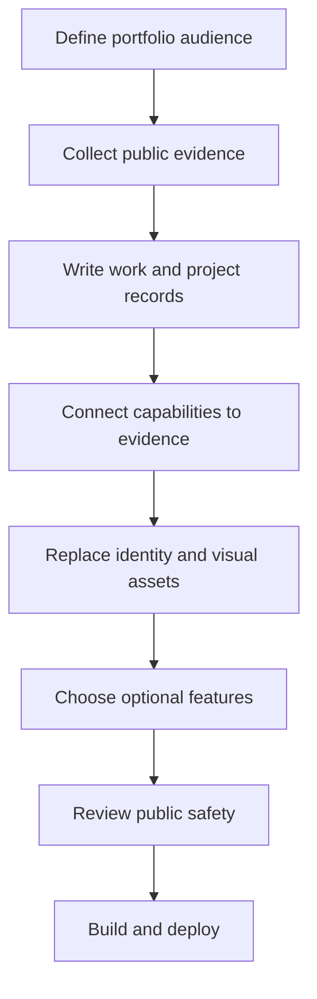
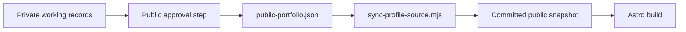

# Customizing the portfolio

Burton Makes can be used as a reference for building an evidence-based engineering portfolio. This guide separates the reusable structure from the personal material that needs to be replaced.

## Begin with the story, not the styling

The site is organized around four questions a visitor is likely to ask:

1. Who is this person and what kinds of problems do they work on?
2. What roles and projects demonstrate that experience?
3. What measurable evidence supports the claims?
4. Where can the visitor learn more or make contact?

Writing those answers first makes it easier to decide which routes and interactive features are useful for a new portfolio.

## Reuse boundary

The repository contains both reusable implementation patterns and Alex Burton's personal portfolio material.

| Usually reusable | Replace for a personal fork |
| --- | --- |
| Astro route structure | Name, biography, role descriptions, and project narratives |
| Data-driven work and project detail pages | Metrics, publications, links, and evidence |
| Shared layout and responsive components | Logo, favicon, photographs, and brand language |
| Capability-to-evidence pattern | Capability taxonomy and its source relationships |
| GitHub Pages workflows | Domain, analytics, API, and Cloudflare configuration |
| Recruiter and 3D interaction patterns | Model assets, prompts, service copy, and rate limits |

Replace Alex's identity and work before deploying a personal fork; the example content is not part of the reusable template layer.

## A practical customization sequence



### 1. Define the audience

Choose the primary visitor: a hiring team, collaborators, clients, or a technical community. A portfolio can support more than one audience, but the homepage and navigation work best when one purpose is clear.

### 2. Collect public evidence

For each role or project, gather information that can safely be published:

- the problem or need;
- your scope and ownership;
- the system or process you built;
- measurable outcomes;
- constraints and tradeoffs;
- failures or changes in direction;
- lessons and next steps;
- public links, publications, images, or demonstrations.

Prefer specific evidence over unsupported adjectives. “Reduced a build cycle from six weeks to three” carries more information than “improved manufacturing.”

### 3. Replace site identity

Update `siteMeta` in `src/data/site.ts`:

- `siteTitle`
- `personName`
- `brandName`
- `siteDescription`
- professional and contact links

Then update:

- homepage wording in `src/pages/index.astro`;
- hobbies and personal context in `src/pages/hobbies/index.astro`;
- contact behavior in `src/pages/contact/index.astro`;
- `public/logo.svg`, `public/favicon.svg`, and photographs;
- footer wording in `src/layouts/BaseLayout.astro`;
- the `site` value in `astro.config.mjs`.

### 4. Replace work records

Work records live in the `workHistory` array in `src/data/generated/profile-source.json`.

```json
{
  "id": "unique-role-id",
  "title": "Role title",
  "company": "Organization",
  "dates": "2024 – Present",
  "context": "The environment and problem space.",
  "summary": "A concise description of the role.",
  "responsibilities": ["What the role owned"],
  "accomplishments": ["A result supported by public evidence"],
  "skills": ["Relevant capability"]
}
```

The `id` becomes part of the generated `/work/[id]/` URL and is also used by projects, so it needs to be unique and stable.

### 5. Replace project records

Projects live in the `projects` array in the same JSON file.

```json
{
  "slug": "project-url-slug",
  "title": "Project title",
  "section": "Project domain",
  "type": "prototype / research / product",
  "status": "completed",
  "timeline": "2024",
  "parentExperienceId": "unique-role-id",
  "visibility": "public-approved",
  "summary": "One-sentence project summary.",
  "skills": ["Capability"],
  "labels": ["Topic"],
  "links": [{ "label": "Public source", "href": "https://example.com" }],
  "why": "Why the project existed.",
  "built": "What you built.",
  "worked": "What produced useful results.",
  "failed": "What did not work or changed.",
  "learned": "What the work taught you.",
  "stack": ["Tool or system"],
  "nextSteps": "What could happen next.",
  "facts": ["A quantitative or externally verifiable detail."]
}
```

Accepted project status values are `active`, `building`, `planning`, `completed`, and `archived`.

### 6. Rebuild the capability map

`src/data/capability-map.ts` connects broad capabilities to work and project records. It looks up sources by role title and company or by project slug. After replacing the profile data, update these lookups before running the build.

Good capability nodes describe an area of practice and include evidence from at least one concrete source. They are most useful when they help a visitor discover related work rather than repeating a list of keywords.

### 7. Curate proof points

`src/data/publicFacts.ts` contains compact metrics used on work and project pages. Keep these values consistent with the longer profile records. A small set of defensible numbers is more useful than a large set of estimates with unclear provenance.

## Choose a data workflow

### Single-repository workflow

For a straightforward fork, keep the public work and project data in this repository. You can continue editing `src/data/generated/profile-source.json`, or rename it to a non-generated path and update the import in `src/data/site.ts`.

If the external sync is not part of your workflow, remove or replace the `profile:sync` script in `package.json`. The normal `npm run build` command does not run that sync script.

### Split private/public workflow

Alex's workflow can author fuller records outside this repository and publish an approved subset through `scripts/sync-profile-source.mjs`.



The script expects a source file at `../job-search/profile/public-portfolio.json` unless `JOB_SEARCH_ROOT` points elsewhere. It validates the public schema before replacing the committed snapshot. A fork can preserve this pattern with its own source repository and access controls.

## Decide which advanced features belong

### Recruiter review

The static recruiter interface can be adapted independently from the Worker. Keeping the live analysis requires a compatible API, public evidence indexing, model configuration, rate limiting, and a clear privacy disclosure. See [Recruiter review architecture](RECRUITER_ASSISTANT_WORKFLOW.md).

### Cocometric 3D story

The Cocometric route is an example of explaining a complex physical system through staged component highlights. Reusing the pattern with another model requires:

- a GLB with stable, descriptive node names;
- an updated component-name map and camera stages;
- replacement copy and service links;
- validation rules that match the new model.

If the 3D story is not relevant, remove the route, its styles, `src/scripts/cocometric-viewer.js`, the embedded model parts, and `validate:cocometric` from the build.

### Analytics hooks

`GlobalEffects.jsx` emits events through the small wrapper in `src/lib/analytics.ts`. If no compatible `window.plausible` function is installed, these calls do nothing. A fork can add its own analytics loader, replace the wrapper, or remove the hooks.

## Public-safety review

Before the first public push, inspect:

- every JSON record and page string;
- images and image metadata;
- external URLs and email addresses;
- Git history, not only the current files;
- `.env` files and deployment configuration;
- infrastructure names, internal hostnames, and screenshots;
- employer, study, patient, customer, and collaborator information;
- model prompts and API request logs;
- third-party assets and their licenses.

The `visibility: "public-approved"` field describes the intended content boundary; it is not a substitute for a manual review.

## Local verification

```bash
npm install
npm run build
npm run dev
```

The build checks the embedded model and recruiter contract, then generates the static site. After it passes, review the key routes at desktop and mobile widths and test keyboard navigation and reduced-motion mode.

## Deploy with GitHub Pages

1. Set `site` in `astro.config.mjs` to the final public origin.
2. In the repository settings, choose **GitHub Actions** as the Pages source.
3. Push the finished changes to `main`.
4. `.github/workflows/deploy.yml` builds and publishes the site.
5. Confirm that internal links, the contact destination, and any optional API endpoint use the production URLs.

The architecture is intentionally modular: a useful portfolio can keep only the static routes and data model, then add the recruiter or 3D features later when they serve a clear purpose.
