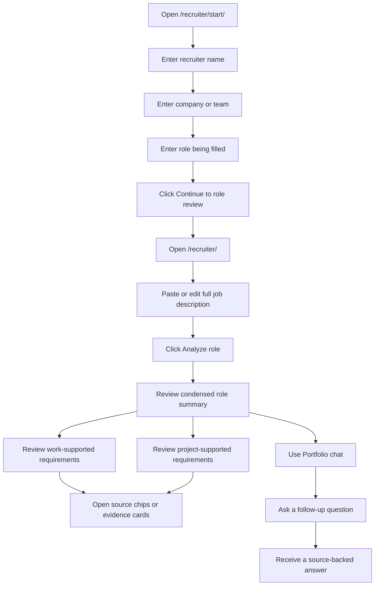
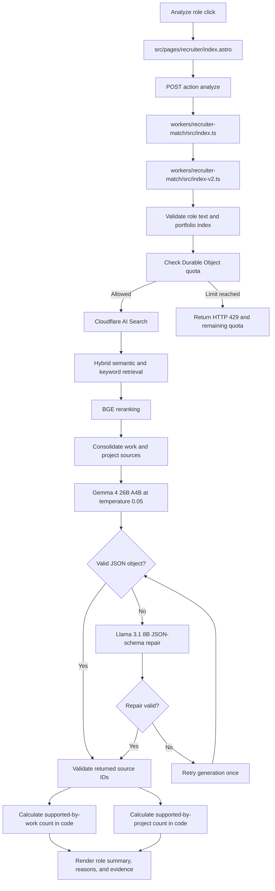
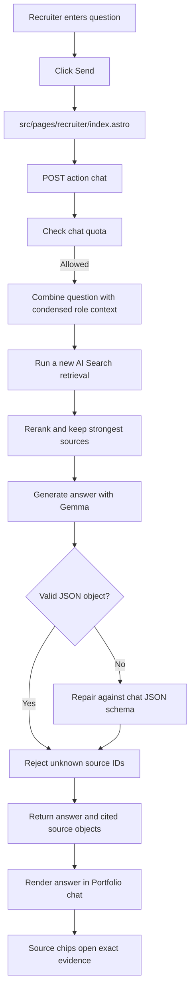

# Recruiter Portfolio Assistant Workflow

This document shows exactly how the recruiter-facing workflow operates, which files provide the portfolio evidence, which buttons trigger requests, and how Cloudflare usage is limited.

## Recruiter experience

### Exact buttons

| Page | Button | Result |
| --- | --- | --- |
| `/recruiter/start/` | `Continue to role review` | Saves recruiter name, company, and role in local browser storage, then opens `/recruiter/`. |
| `/recruiter/` | `Edit recruiter information` | Opens the recruiter context dialog. Changing context marks an existing analysis stale. |
| `/recruiter/` | `Analyze role` | Sends the recruiter context, editable role text, and compact public portfolio index to the Cloudflare Worker. |
| `/recruiter/` | `Clear role` | Clears the role text, previous analysis, and chat conversation in the browser. |
| `/recruiter/` | `Send` | Sends one portfolio-chat question after a role has been analyzed. |
| `/recruiter/` | Source chip | Opens the exact evidence excerpt and a link to the complete public portfolio page. |

## Initial analysis workflow

The model does not create the displayed evidence counts directly. The Worker counts unique requirement IDs linked to validated work sources and validated project sources.

## Portfolio chat workflow

Each chat question runs a fresh retrieval. The chat does not rely only on the evidence cards from the initial analysis.

## Where the information comes from

### Browser and page files

| File | Responsibility |
| --- | --- |
| `src/pages/recruiter/start.astro` | Initial recruiter name, company, and target-role form. |
| `src/pages/recruiter/index.astro` | Editable job-description field, analysis request, evidence rendering, source drawer, and Portfolio chat. |
| `public/recruiter-state-bridge.js` | UTC quota-display reset, stale-analysis handling, and persisted chat-source objects. |
| `src/data/site.ts` | Canonical public work-history and project content used to build the compact portfolio index. |
| `src/data/capability-map.ts` | Connects public work and project sources to capability labels and supporting evidence. |

The static page builds `portfolioIndex` from `src/data/site.ts` and `src/data/capability-map.ts`. Each item includes a stable evidence ID, title, source type, public URL, summary, highlights, tags, and capabilities.

### Worker and Cloudflare files

| File | Responsibility |
| --- | --- |
| `workers/recruiter-match/src/index.ts` | Production entrypoint. Normalizes structured responses, repairs malformed JSON with a schema-capable model, and hides raw parser errors. |
| `workers/recruiter-match/src/index-v2.ts` | Analyze and chat API, retrieval, model calls, source validation, and quota handling. |
| `workers/recruiter-match/wrangler.toml` | Workers AI binding, AI Search binding, Durable Object binding, model selection, origins, and quotas. |
| `workers/recruiter-match/README.md` | Deployment and Cloudflare configuration instructions. |

### Indexed public pages

The AI Search instance is intended to index:

- `/work/`
- `/projects/**`

It should exclude recruiter pages, contact pages, navigation, footer text, and repeated page chrome.

If AI Search is unavailable or empty, the Worker falls back to ranking the compact public portfolio index supplied by the page. This is a retrieval fallback only; the recruiter does not see a separate fuzzy-analysis product or percentage.

## Model configuration

| Setting | Value |
| --- | --- |
| Primary generation model | `@cf/google/gemma-4-26b-a4b-it` |
| JSON repair model | `@cf/meta/llama-3.1-8b-instruct-fast` |
| Temperature | `0.05` |
| Top-p | `0.9` |
| Seed | `1701` |
| AI Search mode | Hybrid semantic and keyword retrieval |
| Reranker | `@cf/baai/bge-reranker-base` |
| Analysis sources | Up to 8 consolidated sources |
| Chat sources | Up to 6 consolidated sources |

Gemma performs the evidence reasoning and writing. If its response is not valid JSON, the entrypoint sends only the malformed structured response to the smaller repair model with an explicit JSON Schema. The repair model cannot add portfolio evidence because source IDs are still validated by the core Worker. The core generation path also retries once. Raw JSON parser messages are never returned to the recruiter.

## Source-safety rules

1. The model receives only retrieved public evidence.
2. The model must return source IDs from that supplied list.
3. `validateSourceIds` removes IDs that were not retrieved.
4. Reasons without a valid source are removed.
5. Evidence entries without a valid source and requirement ID are removed.
6. Chat answers may state that the public portfolio does not clearly document an answer.
7. JSON repair may correct structure but cannot bypass source-ID validation.

## Daily limits

Limits reset at 00:00 UTC.

| Action | Per connection | Site-wide |
| --- | ---: | ---: |
| Role analysis | 10/day | 100/day |
| Portfolio chat | 5/day | 50/day |

The Durable Object stores hashed connection identifiers and counters. It does not store recruiter names, job descriptions, or chat text.

## GitHub validation

The dedicated workflow is `.github/workflows/validate-recruiter-assistant.yml`.

It runs these checks on recruiter-related pull requests and manual dispatches:

1. Install repository dependencies.
2. Run `npm run validate:recruiter`.
3. Compile the Cloudflare Worker with a Wrangler dry run.
4. Build the complete Astro site.
5. Confirm the Cocometric model output still validates through the normal build command.

The repository validation script is `scripts/validate-recruiter-assistant.mjs`. It checks required UI controls, Worker functions, structured-response protection, Cloudflare bindings, documentation, and removal of obsolete fuzzy-matcher files.

## Deployment dependencies

The page can render without the Worker, but analysis and chat require:

1. A Cloudflare AI Search instance named `burton-portfolio`.
2. The deployed Worker from `workers/recruiter-match/wrangler.toml`.
3. GitHub Actions variable `PUBLIC_RECRUITER_MATCH_API` set to the deployed Worker endpoint.
4. A GitHub Pages rebuild after the variable is set.
