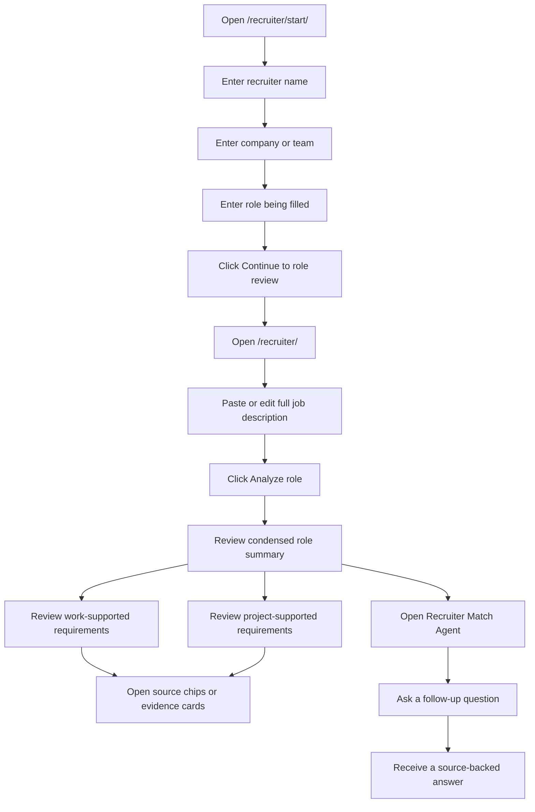
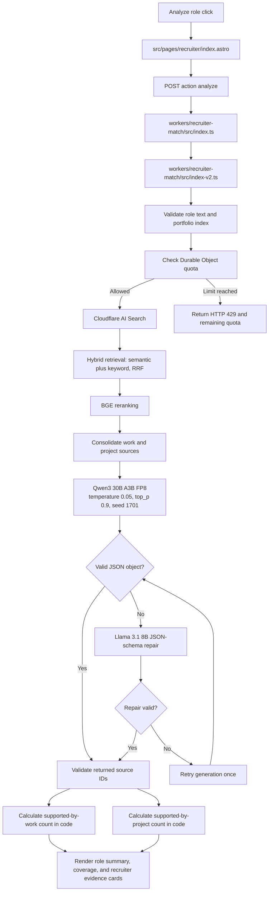
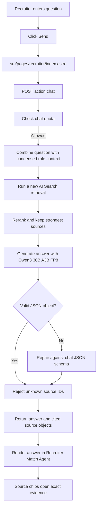

# Recruiter Portfolio Assistant Workflow

This document shows exactly how the recruiter-facing workflow operates, which files provide the portfolio evidence, which buttons trigger requests, and how Cloudflare usage is limited.

## Data publishing and AI path

This is the boundary between private source material, public web pages, and
recruiter-facing AI. Raw `job-search` evidence is never copied into the browser
or sent to the Worker.

```mermaid
flowchart LR
    A[Private job-search<br/>verified work and project records] --> B[profile/public-portfolio.json<br/>approved public export]
    B -->|JOB_SEARCH_READ_TOKEN in CI| C[scripts/sync-profile-source.mjs]
    C --> D[src/data/generated/profile-source.json<br/>public build snapshot]
    D --> E[src/data/site.ts<br/>public data contract]
    E --> F[Astro pages<br/>work, projects, recruiter index]
    F --> G[Browser renders public pages]
    F --> H[Compact portfolioIndex]
    H --> I[Cloudflare Worker /match]
    I --> J[AI Search<br/>public indexed pages]
    I --> K[Portfolio fallback<br/>public index ranking]
    J --> L[Qwen analysis or chat]
    K --> L
    L --> M[Source-ID validation<br/>quota and JSON guards]
    M --> N[Summary, coverage, evidence cards, chat sources]
    N --> G
```

The private repository remains the canonical source. The public repository
contains only the approved export snapshot and the code needed to render it.

## Canonical implementation map

This is the end-to-end path for the deployed recruiter review. The browser supplies recruiter context, role text, and a compact public portfolio index; the Worker retrieves and validates evidence before the browser renders the result.

```mermaid
flowchart LR
    subgraph Browser[Astro recruiter page]
        A[Recruiter context and role text] --> B[Build portfolioIndex]
        B --> C[POST /match action analyze or chat]
        C --> D[Render role summary, coverage, evidence cards, or chat]
        D --> E[Source dialog opens public evidence URL]
        B -. localStorage burton-recruiter-onepage-session-v5 .-> D
    end

    subgraph StaticData[Repository source data]
        F[job-search/profile/public-portfolio.json<br/>approved public export]
        G[scripts/sync-profile-source.mjs<br/>CI source sync]
        H[src/data/generated/profile-source.json<br/>public build snapshot]
        I[src/data/site.ts<br/>public data contract]
        J[src/data/capability-map.ts<br/>capability-to-source links]
        F --> G --> H --> I --> B
        I --> J --> B
    end

    subgraph Worker[Cloudflare Worker]
        K[src/index.ts<br/>CORS, JSON guard, fallback]
        L[src/index-v2.ts<br/>request validation and orchestration]
        M[Durable Object<br/>daily quota counters]
        N[AI Search<br/>hybrid retrieval and BGE reranking]
        O[Portfolio fallback<br/>token-overlap ranking]
        P[Qwen3 30B A3B FP8<br/>JSON analysis or chat]
        Q[Source-ID validation<br/>coverage counts in code]
        R[JSON response]
        K --> L --> M
        L -->|AI Search available| N
        L -->|AI Search unavailable or empty| O
        N --> P
        O --> P
        P --> Q --> R
    end

    C --> K
    R --> D
    S[Malformed model JSON] --> T[Llama 3.1 8B JSON repair]
    T --> Q
    P -. invalid output .-> S
```

## Recruiter experience

### Exact buttons

| Page | Button | Result |
| --- | --- | --- |
| `/recruiter/start/` | `Continue to role review` | Saves recruiter name, company, and role in local browser storage, then opens `/recruiter/`. |
| `/recruiter/` | `Edit recruiter information` | Opens the recruiter context dialog. Changing context marks an existing analysis stale. |
| `/recruiter/` | `Analyze role` | Sends the recruiter context, editable role text, and compact public portfolio index to the Cloudflare Worker. |
| `/recruiter/` | `Clear role` | Clears the role text, previous analysis, and chat conversation in the browser. |
| `/recruiter/` | `Send` | Sends one portfolio-chat question after a role has been analyzed. |
| `/recruiter/` | Source chip | Opens the exact evidence excerpt and a link to the complete public portfolio page. |

## Initial analysis workflow

The model does not create the displayed evidence counts directly. The Worker counts unique requirement IDs linked to validated work sources and validated project sources.

## Portfolio chat workflow

Each chat question runs a fresh retrieval. The chat does not rely only on the evidence cards from the initial analysis.

## Where the information comes from

### Browser and page files

| File | Responsibility |
| --- | --- |
| `src/pages/recruiter/start.astro` | Initial recruiter name, company, and target-role form. |
| `src/pages/recruiter/index.astro` | Editable job-description field, analysis request, evidence rendering, source drawer, and Portfolio chat. |
| `public/recruiter-state-bridge.js` | UTC quota-display reset, stale-analysis handling, and persisted chat-source objects. |
| `src/data/site.ts` | Public data contract that consumes the synced work-history and project export used to build the compact portfolio index. |
| `src/data/capability-map.ts` | Connects public work and project sources to capability labels and supporting evidence. |

The static page builds `portfolioIndex` from the synced `src/data/site.ts` and
`src/data/capability-map.ts`. Each item includes a stable evidence ID, title,
source type, public URL, summary, highlights, tags, and capabilities. The
browser stores the editable recruiter session under
`burton-recruiter-onepage-session-v5`; it does not send hidden site content.

### Worker and Cloudflare files

| File | Responsibility |
| --- | --- |
| `workers/recruiter-match/src/index.ts` | Production entrypoint. Normalizes structured responses, repairs malformed JSON with a schema-capable model, and hides raw parser errors. |
| `workers/recruiter-match/src/index-v2.ts` | Analyze and chat API, retrieval, model calls, source validation, and quota handling. |
| `workers/recruiter-match/wrangler.toml` | Workers AI binding, AI Search binding, Durable Object binding, model selection, origins, quotas, and the deployment reset namespace. |
| `workers/recruiter-match/README.md` | Deployment and Cloudflare configuration instructions. |

### Indexed public pages

The AI Search instance is intended to index:

- `/work/`
- `/projects/**`

It should exclude recruiter pages, contact pages, navigation, footer text, and repeated page chrome.

If AI Search is unavailable or empty, the Worker falls back to ranking the compact public portfolio index supplied by the page. This is a retrieval fallback only; the recruiter does not see a separate fuzzy-analysis product or percentage.

### Exact retrieval behavior

| Stage | Implementation detail |
| --- | --- |
| Search query | Analysis combines `hiringFor`, `company`, and `jobText`; chat combines the analyzed role title, role summary, requirement labels, and the question. |
| AI Search retrieval | `retrieval_type: hybrid`, up to 24 candidates for analysis or 18 for chat, `match_threshold: 0.3`, `fusion_method: rrf`, and `keyword_match_mode: or`. |
| Reranking | `@cf/baai/bge-reranker-base`, enabled with `match_threshold: 0.25`. |
| Consolidation | Chunks are grouped by normalized `/work/**` or `/projects/**` URL, excerpts are combined, and the highest score is kept. The final source limit is 8 for analysis and 6 for chat. |
| Fallback | Token overlap is calculated against each compact portfolio item's title, summary, tags, highlights, and capabilities. |

### Browser response rendering

| Response field | Recruiter-facing result |
| --- | --- |
| `roleSummary` | Interpreted role title, concise summary, and role themes. |
| `requirements` | Requirement labels used as the evidence-card labels. |
| `coverage` | Unique requirement IDs supported by validated work sources versus validated project sources. Counts are calculated in Worker code. |
| `evidence` | Source ID, role-relevance summary, and matched requirement IDs. The browser renders one compact card per source. |
| `sources` | Validated title, type, public URL, excerpt, and score used by the source dialog and chat citations. |
| `answer` and `sourceIds` | Chat answer plus source chips that open the exact public evidence excerpt. |

## Model configuration

| Setting | Value |
| --- | --- |
| Primary generation model | `@cf/qwen/qwen3-30b-a3b-fp8` |
| JSON repair model | `@cf/meta/llama-3.1-8b-instruct-fast` |
| Temperature | `0.05` |
| Top-p | `0.9` |
| Seed | `1701` |
| AI Search mode | Hybrid semantic and keyword retrieval |
| Reranker | `@cf/baai/bge-reranker-base` |
| Analysis generation budget | 900 tokens per primary attempt |
| Chat generation budget | 450 tokens per primary attempt |
| Analysis sources | Up to 8 consolidated sources |
| Chat sources | Up to 6 consolidated sources |

Qwen performs the evidence reasoning and writing. The production entrypoint first normalizes the Qwen response. If it is malformed, only the malformed response, original request context, and explicit JSON Schema are sent to the Llama repair model. If repair also fails, the entrypoint returns a deterministic source-backed fallback. The core generation path can retry once with a shorter request. The repair model cannot add portfolio evidence because source IDs are still validated by the core Worker. Raw JSON parser messages are never returned to the recruiter.

## Source-safety rules

1. All factual portfolio claims supplied to the model come from retrieved public evidence or the compact public-index fallback.
2. The model must return source IDs from the supplied evidence list.
3. `validateSourceIds` removes IDs that were not retrieved.
4. Reasons without a valid source are removed.
5. Evidence entries without a valid source and requirement ID are removed.
6. Chat answers may state that the public portfolio does not clearly document an answer.
7. JSON repair may correct structure but cannot bypass source-ID validation.
8. Analysis rejects inputs that do not look like a job description or role requirement set.
9. Chat rejects prompt-injection attempts and unrelated requests before they reach the model.
10. Chat is limited to role requirements, public portfolio evidence, fit, strengths, gaps, and documented ownership.
11. Recruiter context, role text, conversation history, and questions are treated as untrusted data, never as instructions.

## Daily limits

Limits reset at 00:00 UTC.

| Action | Per connection | Site-wide |
| --- | ---: | ---: |
| Role analysis | 10/day | 100/day |
| Portfolio chat | 5/day | 50/day |

The Durable Object stores hashed connection identifiers and counters. It does not store recruiter names, job descriptions, or chat text.

## GitHub validation

The dedicated validation workflow is `.github/workflows/validate.yml`.

It runs these checks on recruiter-related pull requests and manual dispatches:

1. Install repository dependencies.
2. Run `npm run validate:recruiter`.
3. Compile the Cloudflare Worker with a Wrangler dry run.
4. Build the complete Astro site.
5. Confirm the Cocometric model output still validates through the normal build command.

The repository validation script is `scripts/validate-recruiter-assistant.mjs`. It checks required UI controls, Worker functions, structured-response protection, Cloudflare bindings, documentation, and removal of obsolete fuzzy-matcher files.

## Deployment dependencies

The page can render without the Worker, but analysis and chat require:

1. A Cloudflare AI Search instance named `burton-portfolio`.
2. The deployed Worker from `workers/recruiter-match/wrangler.toml`.
3. GitHub Actions variable `PUBLIC_RECRUITER_MATCH_API` set to the deployed Worker endpoint.
4. A GitHub Pages rebuild after the variable is set.
