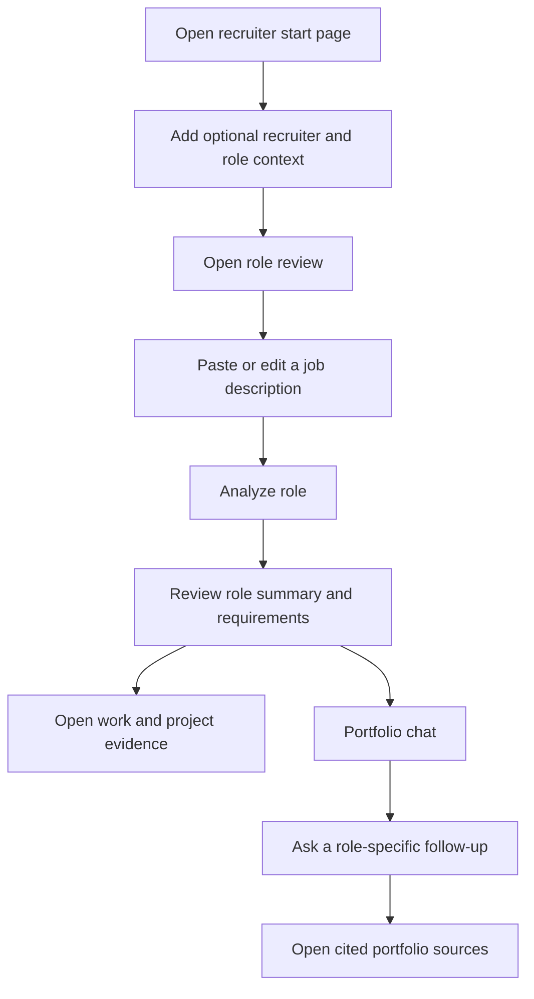
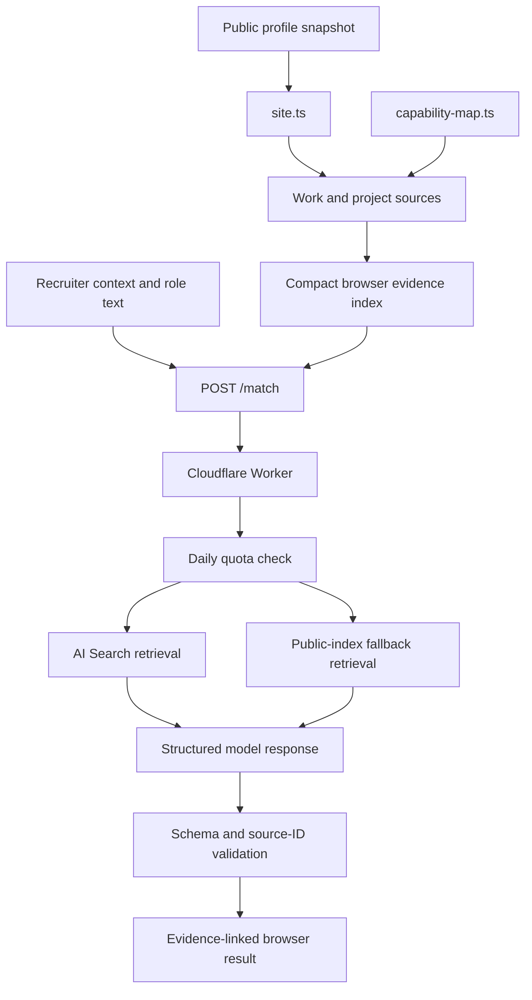
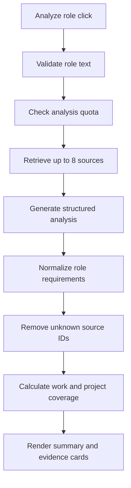
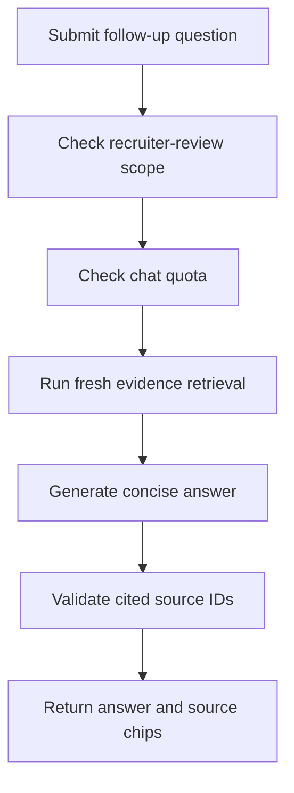

# Recruiter review architecture

The recruiter review is an optional layer on top of the public portfolio. A recruiter can paste a role description, see which documented work and projects support its requirements, and ask follow-up questions whose sources link back to the portfolio.

The feature is designed as evidence navigation, not as a hiring score. It does not display a percentage, rank a person, or create claims that are absent from the public records.

## Visitor journey



The start page stores context in the visitor's browser and then opens `/recruiter/`. The review page sends role text only after the visitor selects **Analyze role**. Each chat submission is a separate request.

## End-to-end system



Raw private working records are not part of this path. The browser index is built from the same committed public records that generate `/work/` and `/projects/`.

## Main files

### Browser

| File | Responsibility |
| --- | --- |
| `src/pages/recruiter/start.astro` | Collects optional recruiter name, organization, and role title before review. |
| `src/pages/recruiter/index.astro` | Builds the public evidence index, sends requests, and renders the summary, coverage, evidence cards, dialogs, and chat. |
| `public/recruiter-state-bridge.js` | Preserves browser state, resets UTC usage displays, marks stale analysis, and coordinates the staged loading display. |
| `public/recruiter-response-guard.js` | Normalizes responses, hides raw parser failures, and keeps loading stages visually consistent. |
| `src/styles/recruiter.css` | Defines the two-column review interface, evidence cards, dialogs, chat, and responsive layout. |
| `src/data/site.ts` | Supplies public roles and projects. |
| `src/data/capability-map.ts` | Adds capability labels and evidence relationships to the compact index. |

### Cloudflare

| File | Responsibility |
| --- | --- |
| `workers/recruiter-match/src/index.ts` | Production entrypoint, structured-response guard, JSON repair, and deterministic fallback. |
| `workers/recruiter-match/src/index-v2.ts` | Request validation, retrieval, generation, source checking, response shaping, CORS, and quota handling. |
| `workers/recruiter-match/wrangler.toml` | Workers AI, AI Search, Durable Object, allowed origins, model names, and daily limit configuration. |
| `scripts/deploy-recruiter-worker.mjs` | Deploys the Worker with a new quota namespace. |

## Browser evidence index

The review page builds one compact record for every public work role and project. Each record contains:

- a stable source ID;
- title and source type;
- public portfolio URL;
- summary and selected highlights;
- tags and capability labels.

This index supports two purposes. It gives the Worker a known set of allowed sources, and it provides fallback retrieval if the Cloudflare AI Search instance is empty or unavailable.

## Analysis request



The role text is limited to 10,000 characters and needs to resemble a job description or set of requirements. The Worker combines the role, organization, and submitted text into a retrieval query.

The structured result includes:

| Field | Browser use |
| --- | --- |
| `roleSummary` | Interpreted title, concise summary, and role themes |
| `requirements` | Labels used to organize evidence |
| `coverage` | Unique requirements supported by work sources and project sources |
| `evidence` | Source relevance and connected requirement IDs |
| `sources` | Validated title, URL, excerpt, type, and retrieval score |
| `usage` | Remaining per-connection and site-wide allowance |

Coverage counts are calculated in Worker code after source validation. The generation model does not set the displayed totals.

## Portfolio chat



Chat is limited to the submitted role, Alex's documented experience, strengths, gaps, ownership, and public evidence. Questions outside that scope receive a short explanation of the supported use case instead of reaching the model.

Each accepted question runs a new retrieval and can return up to six consolidated sources. The Worker keeps the most recent six conversation messages for context, limits a question to 1,200 characters, and validates cited IDs against the sources retrieved for that request.

## Retrieval

The preferred path is Cloudflare AI Search over the public work and project pages.

| Stage | Configuration |
| --- | --- |
| Indexed paths | `/work/**` and `/projects/**` |
| Retrieval | Hybrid semantic and keyword search |
| Candidate limit | 24 for analysis, 18 for chat |
| Retrieval threshold | `0.3` |
| Fusion | Reciprocal rank fusion (`rrf`) |
| Keyword mode | `or` |
| Reranker | `@cf/baai/bge-reranker-base` |
| Reranker threshold | `0.25` |
| Final source limit | 8 for analysis, 6 for chat |

Search chunks are grouped by their normalized `/work/**` or `/projects/**` URL. Excerpts are combined, the strongest score is retained, and each grouped source receives a stable ID.

If AI Search is not configured or returns no sources, `fallbackPortfolioSearch` ranks the compact browser index by token overlap across its title, summary, tags, highlights, and capabilities. The response reports which retrieval path was used.

## Models and structured output

| Purpose | Model |
| --- | --- |
| Analysis and chat | `@cf/qwen/qwen3-30b-a3b-fp8` |
| Malformed JSON repair | `@cf/meta/llama-3.1-8b-instruct-fast` |
| Search reranking | `@cf/baai/bge-reranker-base` |

Primary generation uses temperature `0.05`, top-p `0.9`, and seed `1701`. Analysis receives a 900-token primary budget; chat receives 450 tokens.

`index-v2.ts` asks the primary model for one JSON object. `index.ts` provides a second structural guard around that response. If the JSON is malformed, the repair model receives the invalid text and an explicit schema. It does not receive a new set of portfolio facts. If generation and repair both fail, deterministic fallback functions return a source-backed response instead of a raw parser message.

## Evidence and privacy boundaries

The implementation uses several independent controls:

1. Model context contains retrieved public evidence rather than raw private records.
2. Submitted recruiter text is treated as untrusted data.
3. Role analysis is rejected when the text does not resemble role requirements.
4. Chat is rejected when it is unrelated to recruiter review or resembles prompt injection.
5. Returned source IDs are compared with the sources retrieved for that request.
6. Evidence without a valid source or requirement is removed.
7. The interface can state that public evidence does not clearly document an answer.
8. Repair can correct JSON structure but cannot introduce an accepted source ID.
9. Raw model and JSON parser failures are not displayed to the visitor.

The Durable Object stores daily counters under hashed connection identifiers. It does not store recruiter names, role descriptions, or chat text. The role text and questions are still sent to the configured Worker and Workers AI, so a fork needs its own visitor-facing explanation of that behavior.

## Limits

Limits reset at 00:00 UTC.

| Action | Per connection | Site-wide |
| --- | ---: | ---: |
| Role analysis | 10/day | 100/day |
| Portfolio chat | 5/day | 50/day |

`npm run worker:deploy` creates a new `QUOTA_NAMESPACE`, so a deployment begins with fresh counters. The limit values can be changed in `workers/recruiter-match/wrangler.toml`.

## Request examples

### Analyze

```json
{
  "action": "analyze",
  "recruiterContext": {
    "name": "Jordan Lee",
    "company": "Example Company",
    "hiringFor": "Senior Sensor Hardware Engineer",
    "skipped": false
  },
  "jobText": "Full role description...",
  "portfolioIndex": []
}
```

### Chat

```json
{
  "action": "chat",
  "recruiterContext": {},
  "jobText": "Full role description...",
  "analysisContext": {
    "roleSummary": {},
    "requirements": []
  },
  "conversation": [],
  "question": "What evidence supports hardware debugging?",
  "portfolioIndex": []
}
```

The same `/match` endpoint also accepts `action: "usage"` so the page can refresh its current limits.

## Local development

Run the Astro site in one terminal:

```bash
npm run dev
```

Run the Worker in another:

```bash
npm run worker:dev
```

Set `PUBLIC_RECRUITER_MATCH_API` to the local Worker endpoint when testing the complete request path. Without an override, the current page source uses the Burton Makes production Worker endpoint.

Validate the browser and Worker contract with:

```bash
npm run validate:recruiter
```

The validation script checks required interface controls, Worker functions, Cloudflare bindings, structured-response protection, documentation markers, and removal of obsolete recruiter files.

## Deployment

1. Create and populate a Cloudflare AI Search website instance named `burton-portfolio`.
2. Include public work and project paths and exclude recruiter, contact, navigation, and repeated page chrome.
3. Review the allowed origins, model names, and limits in `workers/recruiter-match/wrangler.toml`.
4. Authenticate Wrangler and run `npm run worker:deploy`.
5. Build the static site with `PUBLIC_RECRUITER_MATCH_API` set to the deployed `/match` endpoint when using a different Worker.
6. Deploy the updated GitHub Pages artifact.

## Adapting or removing the feature

A fork can replace the data and retain the overall retrieval pattern. The source-ID contract is the important boundary: every generated claim presented as portfolio evidence resolves to a public record the visitor can open.

To remove the feature, delete the two recruiter routes, the two `public/recruiter-*.js` files, `src/styles/recruiter.css`, the Worker directory, and the Worker scripts. Then remove the corresponding script tags from `BaseLayout.astro`, the recruiter validation command from `package.json`, and recruiter links from the homepage.
