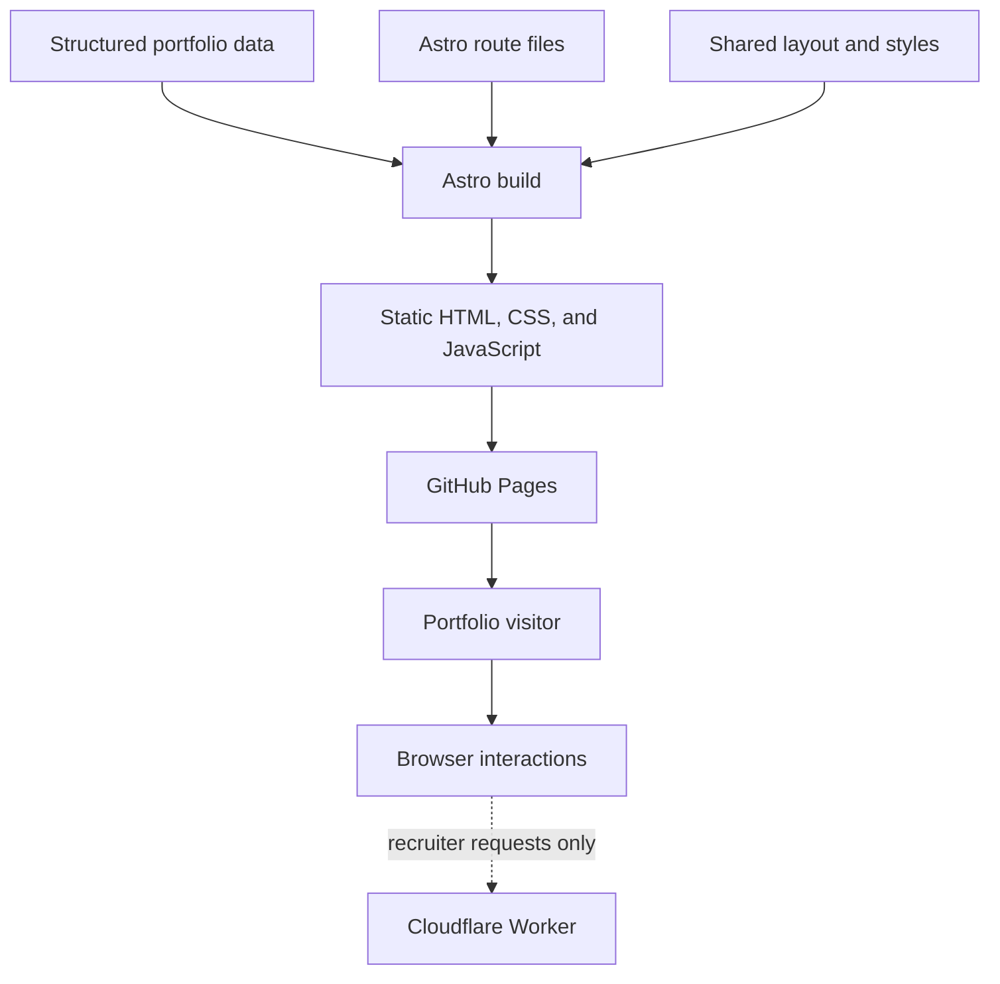
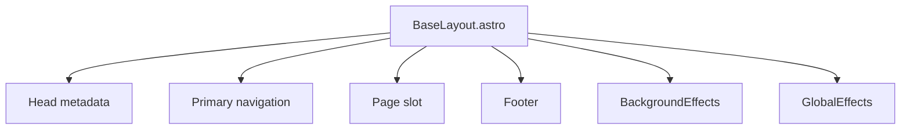
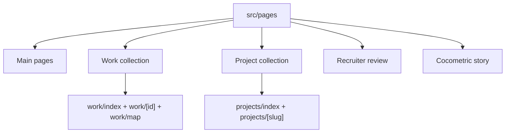
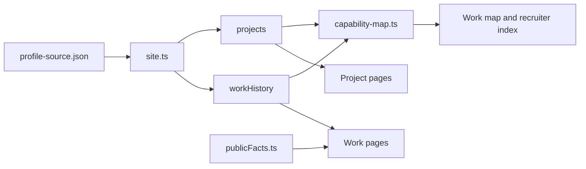
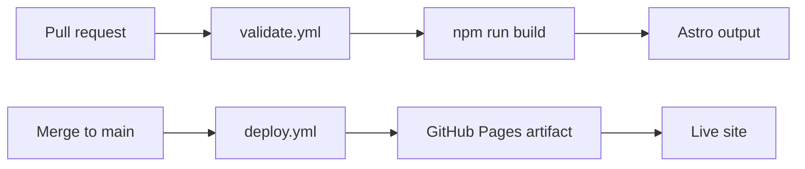

# Site architecture

This document explains how Burton Makes is assembled, how information reaches each page, and where a contributor can make a focused change without having to understand the entire repository first.

## System overview

Burton Makes is primarily a static Astro site. Most pages are generated at build time and published to GitHub Pages. React is used for shared browser effects, while feature-specific JavaScript handles the career explorer, project filtering, recruiter review, and Cocometric 3D scene.

The main portfolio remains readable if the optional Worker is unavailable. WebGL and motion improve the presentation but do not hold the work or project content.

## Rendering layers

| Layer | Files | Responsibility |
| --- | --- | --- |
| Content | `src/data/` | Stores public profile records, metrics, site metadata, and capability relationships. |
| Routes | `src/pages/` | Turns content into URLs and page-specific layouts. |
| Shared shell | `src/layouts/BaseLayout.astro` | Provides document metadata, navigation, footer, background components, and Astro page transitions. |
| Shared interaction | `src/components/GlobalEffects.jsx` | Handles reveals, navigation state, mobile navigation, shared click behavior, and analytics hooks. |
| Shared background | `src/components/BackgroundEffects.jsx` | Renders the particle field, network effect, and pointer-following spotlight with Three.js and GSAP. |
| Shared appearance | `src/styles/global.css` | Defines typography, layout primitives, cards, buttons, responsive behavior, and page-level components. |
| Feature appearance | `src/styles/recruiter.css`, `src/styles/cocometric*.css` | Keeps complex feature styling out of the global stylesheet. |
| Feature logic | Inline route scripts, `public/`, and `src/scripts/` | Implements filters, persisted recruiter state, response guards, and the Cocometric viewer. |
| Optional service | `workers/recruiter-match/` | Retrieves public evidence and returns structured recruiter analysis and chat responses. |

## Shared page shell

Most routes use `BaseLayout.astro`.

The layout reads `navigation` and `siteMeta` from `src/data/site.ts`. `BackgroundEffects` persists through Astro transitions so the WebGL scene does not restart on every internal navigation. `GlobalEffects` initializes route-aware navigation, reveal motion, responsive header behavior, and optional analytics calls.

The Cocometric route intentionally uses its own HTML shell. Its full-screen 3D story has different navigation, loading, scrolling, and styling needs from the main portfolio.

## Route organization

Astro maps the file tree under `src/pages/` directly to public URLs.

| Route group | Rendering pattern | Notes |
| --- | --- | --- |
| Home, hobbies, and contact | One `.astro` file per route | Content is authored directly in the page or imported from `site.ts`. |
| Work index | Static page plus browser interaction | The page renders every role, then JavaScript controls the timeline tabs and detail branches. |
| Work detail | `getStaticPaths()` | One HTML page is generated for every `workHistory` record. |
| Capability map | Static data audit | Capability nodes are linked to work and project evidence before the page is built. |
| Project index | Static page plus browser filtering | Every project is present in the HTML; client JavaScript changes the visible domain. |
| Project detail | `getStaticPaths()` | One HTML page is generated for every project slug. |
| Recruiter review | Static interface plus optional API | Public portfolio evidence is serialized into the page and sent with recruiter requests. |
| Cocometric | Standalone interactive page | The compressed GLB is embedded in JavaScript modules and decoded in the browser. |

## Portfolio data model

### Public profile snapshot

`src/data/generated/profile-source.json` has two main collections:

- `workHistory` contains professional roles;
- `projects` contains case studies linked to those roles through `parentExperienceId`.

Each work record supplies an ID, title, company, dates, context, summary, responsibilities, accomplishments, and skills. Each project supplies a slug, descriptive metadata, public links, facts, skills, and narrative fields such as what was built, what worked, what failed, and what was learned.

`src/data/site.ts` imports this JSON and applies TypeScript shapes before routes consume it. The separation keeps route code focused on presentation rather than parsing raw records.

### Supporting evidence files

| File | Relationship to the profile snapshot |
| --- | --- |
| `src/data/publicFacts.ts` | Pulls high-value quantitative facts into reusable work and project summaries. |
| `src/data/capability-map.ts` | Builds a taxonomy of capabilities and attaches each one to existing work or project sources. |
| `src/data/site.ts` | Combines site identity, navigation, profile records, project types, and compatibility exports. |

## Component responsibilities

### `BackgroundEffects.jsx`

This component owns the site-wide visual atmosphere. It creates the WebGL renderer, particles, connected network nodes, pointer response, resize handling, animation loop, and cleanup. It also checks the visitor's reduced-motion and pointer capabilities before enabling effects.

### `GlobalEffects.jsx`

This component provides behavior shared by otherwise static pages:

- reveal-on-scroll animation;
- active navigation state;
- mobile navigation controls;
- header hide/show behavior;
- animated counters;
- optional interaction and impression events.

Because it is mounted once by the shared layout, page files do not need to repeat these behaviors.

### `BaseLayout.astro`

This is the common document frame. It owns the title and description pattern, favicon and font links, accessibility skip link, primary navigation, content slot, footer, and shared surface tokens used by the main portfolio.

### Work and project routes

The collection pages help visitors scan and compare. The dynamic detail routes turn structured records into repeatable case-study pages. Linking a project to a parent role lets a visitor move between professional context and implementation detail without duplicating the same story.

### Capability map

The capability map is a relationship layer rather than a second résumé. Each node points back to a concrete role or project. Its built-in audit reports capabilities that do not yet have enough supporting evidence, which helps keep broad skill claims connected to source material.

### Recruiter review

The recruiter pages assemble a compact public evidence index from `workHistory`, `projects`, and `capabilityTaxonomy`. The optional Worker retrieves sources relevant to a submitted role or question. Returned source IDs are checked against the retrieved evidence before the browser displays them.

### Cocometric viewer

The Cocometric model is stored as six base64 JavaScript parts under `src/data/cocometric-model/`. `src/scripts/cocometric-viewer.js` joins and decompresses the model, maps named meshes to system layers, interpolates camera positions, and highlights components as the visitor scrolls through seven stages.

## Build and deployment

`npm run build` runs the Cocometric model validation and recruiter contract validation before Astro generates the site. Pull requests and non-`main` branches use `.github/workflows/validate.yml`. Pushes to `main` use `.github/workflows/deploy.yml` to publish the static artifact.

## External dependencies and graceful fallbacks

| Dependency | Used by | Behavior when unavailable |
| --- | --- | --- |
| Google Fonts | Shared typography | The browser uses the system font stack. |
| WebGL | Shared background and Cocometric | Main content remains available; the Cocometric page shows its non-3D service content. |
| Plausible-compatible global function | Optional analytics hooks | Tracking calls become no-ops. |
| Cloudflare Worker | Recruiter analysis and chat | The rest of the portfolio continues to work. |
| Current contact site | Contact handoff | Profile links remain available as alternate contact paths. |

## Where to start for common changes

| Goal | First files to inspect |
| --- | --- |
| Change name, description, or profile links | `src/data/site.ts` |
| Add or revise a role | `src/data/generated/profile-source.json`, then `src/data/capability-map.ts` |
| Add or revise a project | `src/data/generated/profile-source.json`, then `src/data/publicFacts.ts` |
| Change navigation or common footer | `src/data/site.ts`, `src/layouts/BaseLayout.astro` |
| Change the visual language | `DESIGN_SYSTEM.md`, `src/styles/global.css`, `BaseLayout.astro` |
| Change shared motion | `src/components/GlobalEffects.jsx` |
| Change the WebGL background | `src/components/BackgroundEffects.jsx` |
| Change recruiter matching | `src/pages/recruiter/`, `public/recruiter-*.js`, `workers/recruiter-match/` |
| Change the 3D story | `src/pages/cocometric/`, `src/scripts/cocometric-viewer.js`, `src/styles/cocometric*.css` |

For a guided reuse path, continue with [Customizing the portfolio](CUSTOMIZING.md).
