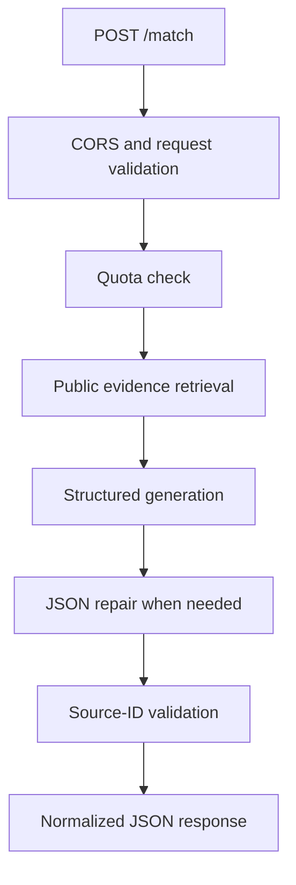

# Recruiter review Worker

This Cloudflare Worker is the optional service behind the Burton Makes recruiter review. It accepts a role analysis, portfolio chat, or usage request and returns a structured response grounded in public work and project sources.

The complete browser-to-Worker flow is documented in [Recruiter review architecture](../../docs/RECRUITER_ASSISTANT_WORKFLOW.md).

## Responsibilities



The Worker provides:

- role-text and chat-scope validation;
- Cloudflare AI Search retrieval with a compact-index fallback;
- structured role analysis and portfolio chat;
- validation of every cited source ID;
- deterministic fallback responses when model output cannot be repaired;
- per-connection and site-wide daily quotas;
- CORS restricted to configured portfolio origins.

It does not serve the portfolio pages or store their complete data set. The browser sends a compact index built from records already approved for public display.

## Implementation

| File | Role |
| --- | --- |
| `src/index.ts` | Production entrypoint, structured response guard, repair model, and deterministic fallback |
| `src/index-v2.ts` | Core API, retrieval, generation, validation, source shaping, and Durable Object |
| `wrangler.toml` | Worker bindings, origins, models, quotas, and deployment defaults |
| `../../scripts/deploy-recruiter-worker.mjs` | Wrangler deployment with a fresh quota namespace |

## Actions

### `analyze`

The analysis action accepts recruiter context, a complete role description, and the public portfolio index. It returns a role summary, normalized requirements, coverage counts, evidence relationships, retrieved sources, and remaining usage.

```json
{
  "action": "analyze",
  "recruiterContext": {
    "name": "Jordan Lee",
    "company": "Example Company",
    "hiringFor": "Senior Sensor Hardware Engineer",
    "skipped": false
  },
  "jobText": "Full role description...",
  "portfolioIndex": []
}
```

### `chat`

The chat action accepts the current role context, recent conversation, one follow-up question, and the public portfolio index. It runs a fresh retrieval and returns a concise answer plus validated source references.

```json
{
  "action": "chat",
  "recruiterContext": {},
  "jobText": "Full role description...",
  "analysisContext": {
    "roleSummary": {},
    "requirements": []
  },
  "conversation": [],
  "question": "What evidence supports hardware debugging?",
  "portfolioIndex": []
}
```

### `usage`

The usage action returns current per-connection allowances without consuming an analysis or chat request.

```json
{
  "action": "usage"
}
```

## Retrieval path

The Worker first asks the configured Cloudflare AI Search instance for hybrid semantic and keyword results. Search chunks are limited to public `/work/**` and `/projects/**` URLs, grouped by page, reranked, and converted to stable evidence sources.

If AI Search is unavailable or empty, the Worker ranks the supplied compact portfolio index by token overlap. This fallback changes retrieval only; generation and source validation follow the same path.

## Model configuration

| Purpose | Default |
| --- | --- |
| Generation | `@cf/qwen/qwen3-30b-a3b-fp8` |
| JSON repair | `@cf/meta/llama-3.1-8b-instruct-fast` |
| Reranking | `@cf/baai/bge-reranker-base` |
| Temperature | `0.05` |
| Top-p | `0.9` |
| Seed | `1701` |
| Analysis source limit | 8 |
| Chat source limit | 6 |

The primary model receives only retrieved evidence and request context. When its JSON is malformed, the production entrypoint gives the invalid response and an explicit schema to the repair model. The core code still rejects any repaired source identifier that was not part of the retrieval result.

## Cloudflare bindings

`wrangler.toml` configures three bindings:

| Binding | Type | Purpose |
| --- | --- | --- |
| `AI` | Workers AI | Runs generation, repair, and reranking models. |
| `AI_SEARCH` | AI Search namespace | Opens the configured public portfolio search instance. |
| `RATE_LIMITER` | Durable Object | Stores daily counters for connection and site-wide limits. |

The important variables are:

| Variable | Purpose |
| --- | --- |
| `ALLOWED_ORIGINS` | Comma-separated browser origins accepted by CORS |
| `GENERATION_MODEL` | Primary analysis and chat model |
| `JSON_REPAIR_MODEL` | Structured-output repair model |
| `AI_SEARCH_INSTANCE` | Name of the website search instance |
| `QUOTA_NAMESPACE` | Counter namespace changed at deployment |
| `PER_CLIENT_ANALYSIS_LIMIT` | Daily analyses per hashed connection |
| `GLOBAL_ANALYSIS_LIMIT` | Daily analyses across the site |
| `PER_CLIENT_CHAT_LIMIT` | Daily chat questions per hashed connection |
| `GLOBAL_CHAT_LIMIT` | Daily chat questions across the site |

## Daily limits

Counters reset at 00:00 UTC.

| Action | Per connection | Site-wide |
| --- | ---: | ---: |
| Role analysis | 10/day | 100/day |
| Portfolio chat | 5/day | 50/day |

The Durable Object hashes the connection identifier and stores counters. Recruiter names, role descriptions, and chat text are not written to Durable Object storage.

`npm run worker:deploy` passes a timestamped `QUOTA_NAMESPACE` to Wrangler, so every deployment begins with a new counter namespace.

## Local development

From the repository root:

```bash
npm install
npm run worker:dev
```

Run the Astro site separately with `npm run dev` and set `PUBLIC_RECRUITER_MATCH_API` to the local Worker's `/match` endpoint when testing the complete interface.

The Worker can still exercise fallback retrieval before an AI Search instance has been populated, as long as the browser request includes a public portfolio index.

## Validation

```bash
npm run validate:recruiter
npx wrangler deploy --dry-run --config workers/recruiter-match/wrangler.toml
```

The repository's normal `npm run build` includes the recruiter contract validation. The dry run adds Worker compilation and binding checks.

## Deployment

1. Create and sync a Cloudflare AI Search website instance named `burton-portfolio`.
2. Index `/work/**` and `/projects/**` from the public site.
3. Exclude recruiter pages, contact pages, navigation, footer text, and repeated page chrome.
4. Update the allowed origins, models, and limits in `wrangler.toml` for the new deployment.
5. Authenticate Wrangler.
6. Deploy from the repository root:

```bash
npm run worker:deploy
```

7. Build the portfolio with the deployed endpoint when it differs from the Burton Makes default:

```text
PUBLIC_RECRUITER_MATCH_API=https://<worker>.workers.dev/match
```

8. Publish a new static site build.

## Operational notes

- Request context is treated as untrusted data, including text that resembles instructions.
- Role analysis accepts only text that resembles a job description or requirements list.
- Chat accepts only recruiter-review questions about the role and documented portfolio.
- Unknown source IDs are removed before a response reaches the browser.
- Raw model parser errors are converted to a stable fallback or retry message.
- Model and quota changes can affect Workers AI usage; review current Cloudflare limits before raising budgets.
